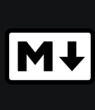
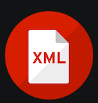

# Lenguaje de marcas UD1 

## Definiciones lenguajes de marcas

### Difinición

Lenguaje de marcas: Organiza información mediante una sintaxis basada en marcas o etiquetas

### Tipos de lenguajes de marcas

|Tipo|Para qué sirve|Ejemplos|
|----|--------------|--------|
|Presentación|Muestra contenido formateado|*HTML*, *CSS*|
|Descriptivo|Intercambio información|*XML*, *JSON*|
|Documentación|Documentar proyectos|*Markdown*, *LaTex*|

## Instalación y configuración del entorno de trabajo

1. Instalar [VS Code](https://code.visualstudio.com/)
2. Instalar plugins
   - [HTML CSS Support](https://marketplace.visualstudio.com/items?itemName=ecmel.vscode-html-css)
   - [Live Preview](https://marketplace.visualstudio.com/items?itemName=ms-vscode.live-server)
   - [Markdown All in One](https://marketplace.visualstudio.com/items?itemName=yzhang.markdown-all-in-one)
   - [XML - Red Hat](https://marketplace.visualstudio.com/items?itemName=redhat.vscode-xml)
3. Instalar git
```bash
 sudo apt install git
 ```
4. Crear repositorio, añadir código y hacer commit
```bash
 
 ```
## Plugins instalados

|Nombre|Imagen|Uso|
|------|------|---|
|**HTML CSS Support**||Añade autocompletado inteligente|
|**Live Preview**||Permite ver una vista previa en tiempo real de tus páginas web|
|**Markdown All in One**||Visualizar presentación de Markdown|
|**XML - Red Hat**||Ofrece soporte avanzado para crear, editar y validar documentos|
